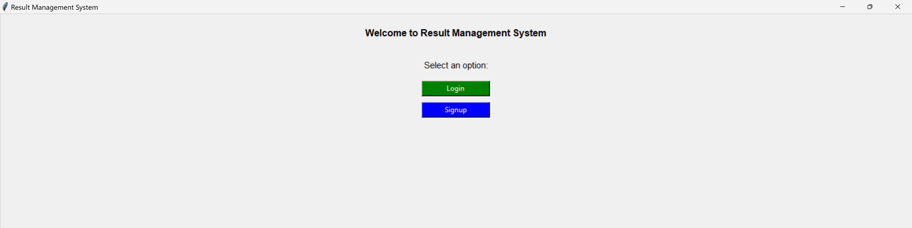
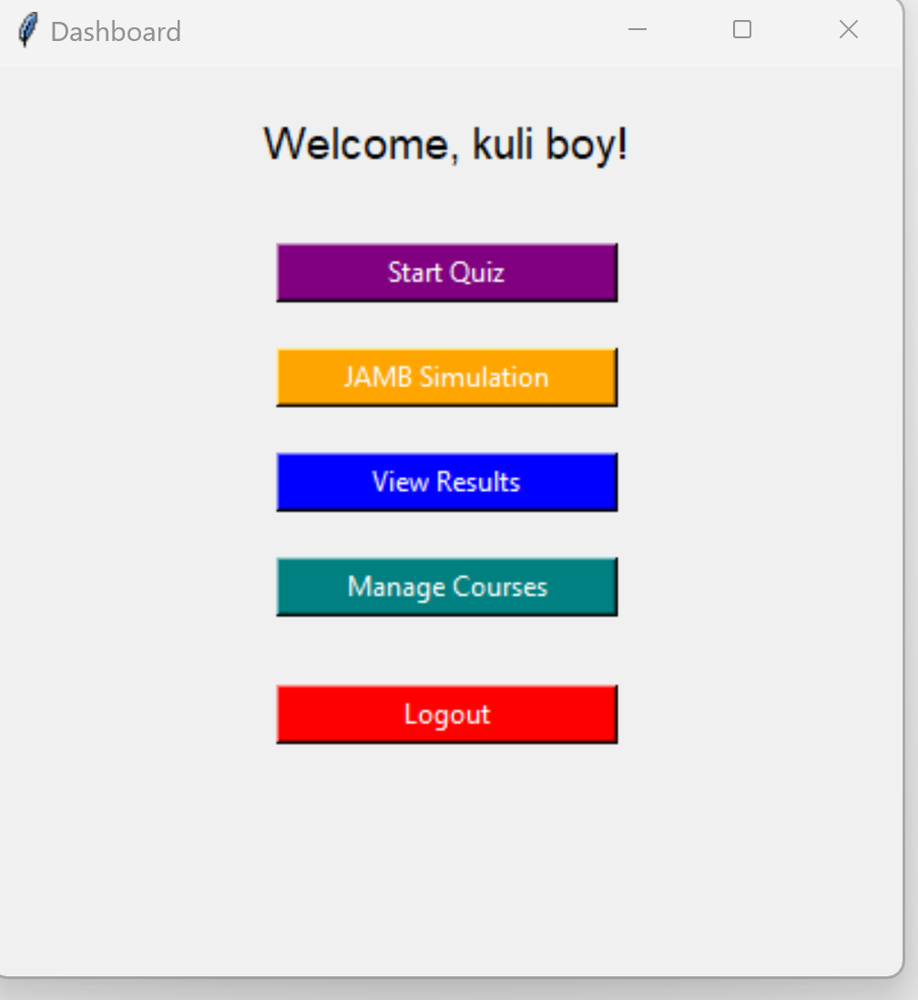
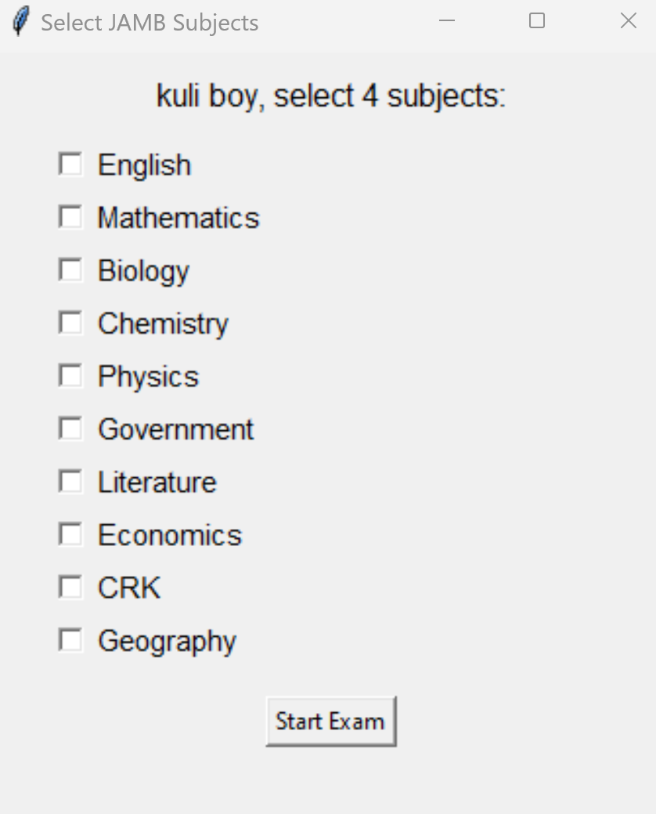
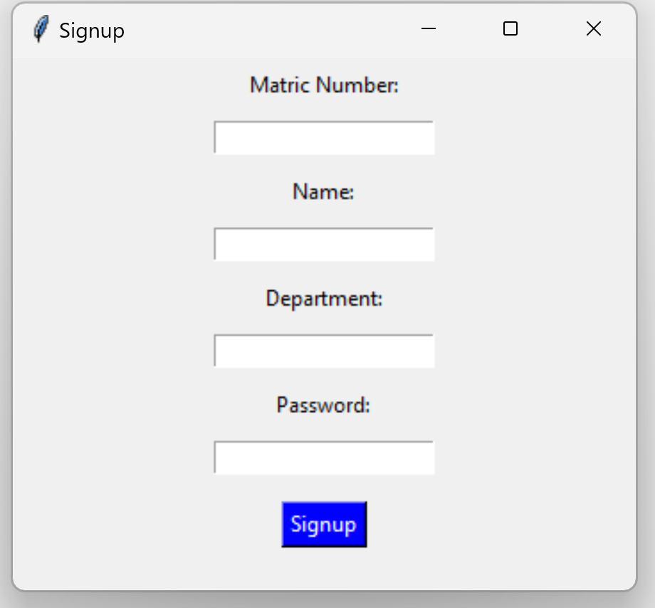

# 📚 Result Management System


A desktop-based academic **Result Management and Computer-Based Testing (CBT)** application built with **Python, Tkinter, and SQLite**.

The system enables students to register, log in, take quizzes or JAMB-style examinations, and view their results, while administrators manage courses and monitor student performance through a centralized dashboard.

---

## ✨ Features

- Student Registration & Login
- Secure Authentication
- Interactive CBT Examination
- JAMB Simulation Mode
- Automatic Score Calculation
- Result Storage using SQLite
- Individual Result Viewer
- Administrator Dashboard
- Course Management
- User-friendly Tkinter Interface

---

## 🛠 Technologies Used

- Python
- Tkinter (GUI)
- SQLite (Database)
- JSON (Question Bank)
- Git & GitHub

---

## 💡 Skills Demonstrated

- Object-Oriented Programming (Python)
- Desktop GUI Development
- SQLite Database Design
- Authentication System
- CRUD Operations
- JSON Data Processing
- Software Architecture
- Git Version Control

---

## 📷 Screenshots

### Login Page



---

### Dashboard



---

### JAMB Subject Selection



---

### Student Signup



---

## 📂 Project Structure

```text
RESULT-MANAGER2
│
├── source/
│   ├── LOGIN_WINDOW.py
│   ├── auth.py
│   ├── course_manager.py
│   ├── dashboard.py
│   ├── database.py
│   ├── jamb_exam_window.py
│   ├── quiz_simulator.py
│   ├── result.py
│   ├── result_viewer.py
│   ├── questions.json
│   ├── jamb_questions.json
│   └── ...
│
├── screenshots/
│
├── README.md
│
└── .gitignore
```

---

## ▶️ Getting Started

### Clone the repository

```bash
git clone https://github.com/Durodola2/RESULT-MANAGER2.git
```

### Navigate into the project

```bash
cd RESULT-MANAGER2
```

### Run the application

```bash
python source/LOGIN_WINDOW.py
```

---

## 🚀 Future Improvements

- Export results to PDF
- Password hashing for enhanced security
- Online database integration
- Role-based permissions
- Student performance analytics dashboard
- Dark mode interface
- Multi-user support

---

## 👨‍💻 Author

**David Durodola**

📧 Email: durodoladavid3@gmail.com

🐙 GitHub: https://github.com/Durodola2

---

## ⭐ Support

If you found this project helpful, consider giving it a ⭐ on GitHub.